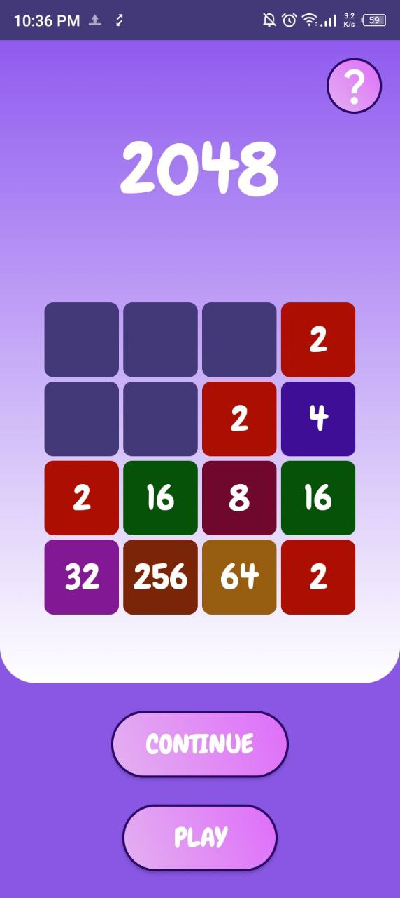
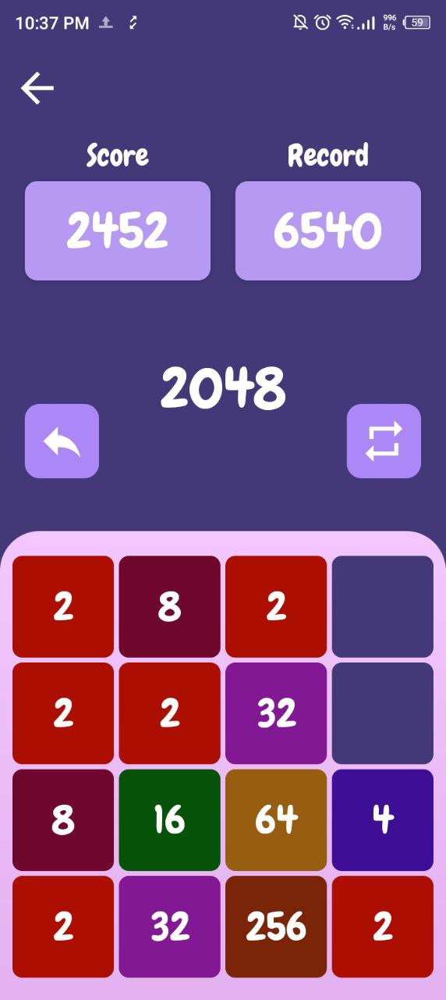
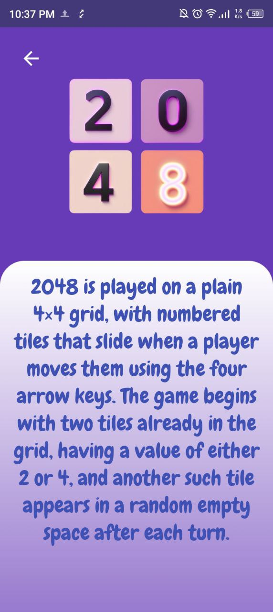

# 2048 Game (Android)

Welcome to the 2048 Game app repository! This app is a classic 2048 game where players swipe to combine tiles and reach the 2048 tile. It is developed using native Android technologies and offers a fun and engaging experience for users.

---

### 📱 App Overview

2048 is a sliding puzzle game where the player combines tiles with matching numbers to create a tile with the number 2048. The app features a responsive touch interface, allows for saving and loading game progress, and provides a smooth, interactive user experience.

---

### ⚙️ Technologies Used

- **OnTouchListener**: Detects touch events on the screen and enables swipe gestures for game actions.
- **SharedPreferences**: Used to save and load game progress, such as the current game state and highest score.
- **Elastic View**: Adds a smooth and interactive elastic effect to views when swiping or interacting with the game grid.

---

### 🖼️ Screenshots

<table>
  <tr>
    <td></td>
    <td></td>
  </tr>
  <tr> 
<td></td>
  </tr>
</table>

### 📋 Features

- **Touch Gestures**: Swipe tiles to combine matching numbers.
- **Game Progress**: Game state (board and score) is saved and loaded via SharedPreferences.
- **Elastic View**: Provides an engaging and smooth swipe animation.
- **High Scores**: Track your highest score and try to beat it in each new session.

---